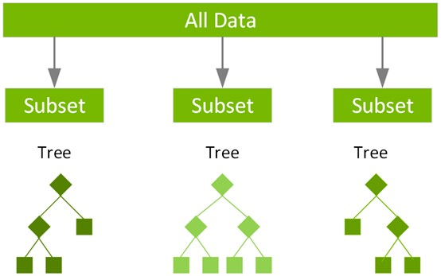

## Hello

👋 Hi, my name is Andy, come from Taiwan, with 2 years working experience as a data analyst

👀 I’m interested in Data Analytics and Data Science opportunities in the United States

🌱 I’m currently a Master Student major in Analytics at University of Southern California

💞️ I’m a highly responsible person who is also cooperative, meticulous, and innovative. Always eager to learn new things with considerable passion and curiosity. Based on my study and experiences in Data Analytics, I look forward to exploring more and applying what I have learned to business. No matter facing any challenges, I will be well prepared, adapt to new changes, and tackle them with an optimistic attitude.

📫 How to reach me: Email: wuchungm@usc.edu ; Linkedin: www.linkedin.com/in/chungmingwu

## SMOTE-with-XGBoost-for-imbalanced-dataset

This is one of the HW assignment at USC, using SMOTE to solve a seriously imbalanced dataset with a large number of features and data points.

1. Deal with missing values data. 
2. XGBoost and Model Trees (Majority Pooling)
3. XGBosst with L1-penalized Model

## Machine Learning for Data Science

## XGBoost

